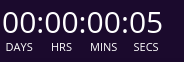

# react-countdown-master
Simple count down timer for ReactJs



#### Getting Started
```
npm install react-countdown-master
npm start
```
#### Basic Usage
```
import React from 'react';
import Timer from 'react-countdown-master';

ReactDOM.render(
  <Timer date={Date.now() + 10000} />,
  document.getElementById('root')
);
```

